# Transaction Intelligence Platform

> A pluggable platform that runs **five independent fintech analyzers** over the same payment data and surfaces everything they find in one unified review queue. One backbone, five swappable brains, one contract.

| # | Analyzer | Detects / does | Technique | Metric |
|---|---|---|---|---|
| 1 | **AML** | fraud + laundering (structuring, velocity, geo, large-amount) | rules + baselines + ML ensemble + LLM explain | PR-AUC / Recall |
| 2 | **Reconciliation** | breaks between ledger and processor | fuzzy matching + discrepancy typing + LLM | Precision / Recall |
| 3 | **Categorization** | merchant category / purpose code | normalize → lookup → TF-IDF + NB | Macro-F1 |
| 4 | **Disputes** | chargeback lifecycle + deadlines + rebuttals | reason-code FSM + LLM draft | Win rate |
| 5 | **Reporting** | SAR narratives from other analyzers' findings | grounded LLM + faithfulness check | Grounding |

---

## 1. System architecture

The whole platform on one screen — sources flow into the backbone, the backbone runs the five analyzers, every analyzer writes into one unified `Finding` store, and the API + dashboard surface it.

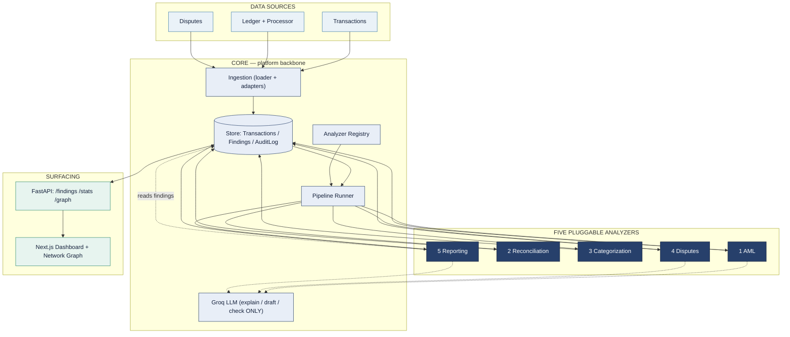

---

## 2. The contract that makes it pluggable

Every analyzer implements **one interface**. That is the entire architecture — add a sixth analyzer by dropping in a class, not by rewiring the system.

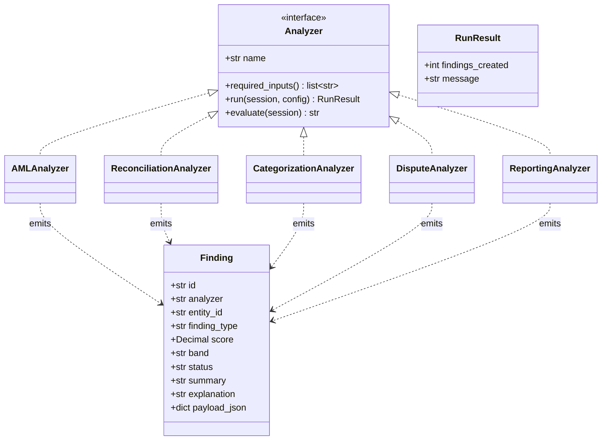

---

## 3. Traceability — how any of the five is tracked

Every analyzer writes into the **same `Finding` table**, so a flagged transaction, a reconciliation break, a low-confidence category, a dispute deadline, and a drafted SAR all land in one queue — each traceable back to the evidence that produced it.

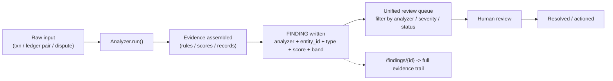

A finding moves through an explicit status lifecycle:

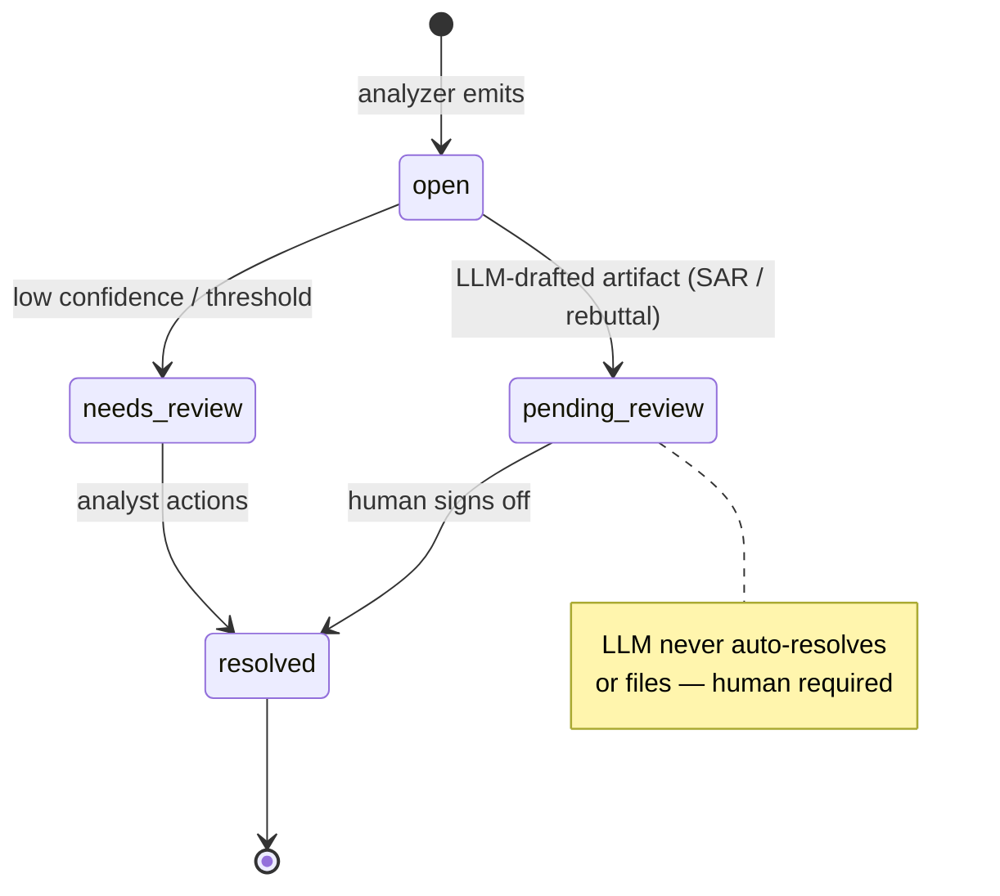

---

## 4. Data model

The shared `Finding` is the spine; each analyzer keeps its own domain tables for detail.

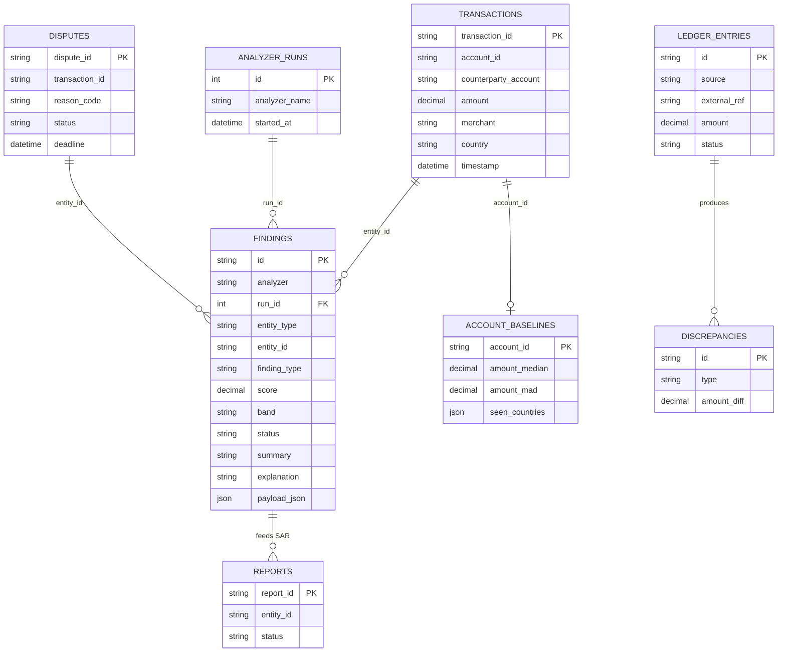

---

## 5. The five analyzers — one pipeline each

Same contract, five completely different brains. Each gets equal depth below.

### 1 — AML  ·  *rules + baselines + ensemble ML + LLM*

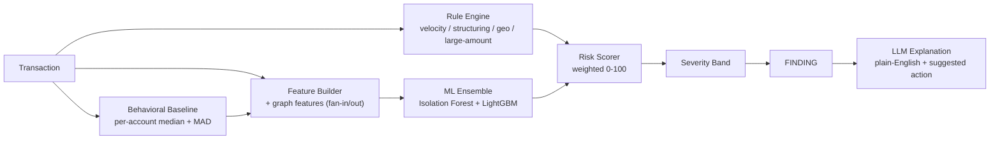

### 2 — Reconciliation  ·  *matching + discrepancy typing + LLM*

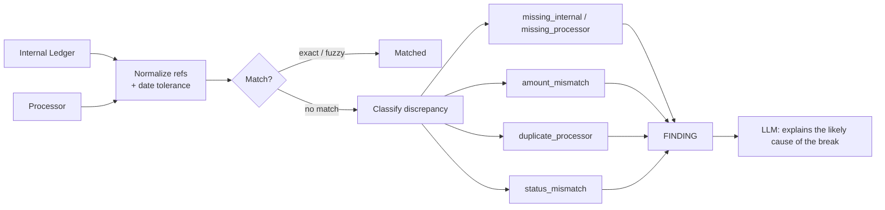

### 3 — Categorization  ·  *normalize → lookup → ML*

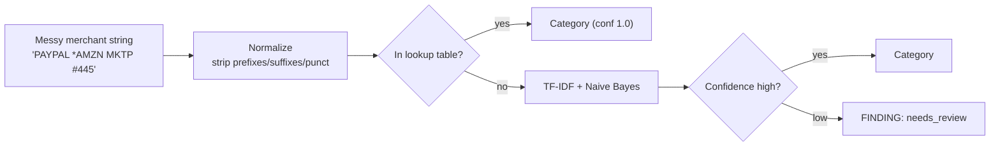

### 4 — Disputes  ·  *reason-code FSM + deadlines + LLM rebuttal*

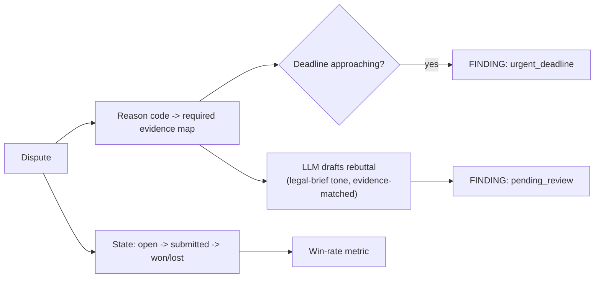

State machine:

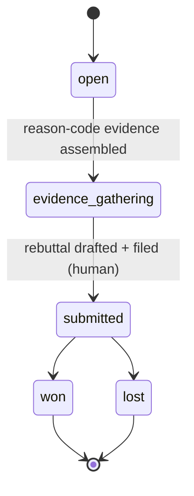

### 5 — Reporting  ·  *grounded SAR + faithfulness check (the capstone)*

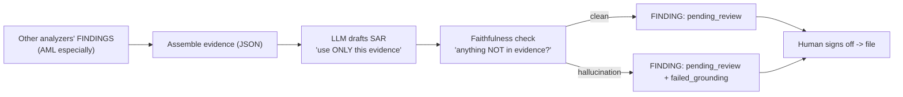

---

## 6. Deployment topology

Frontend on Vercel; the Python/ML backend on a container host with Postgres. (Vercel cannot host the stateful FastAPI + ML backend — see `DEPLOYMENT.md`.)

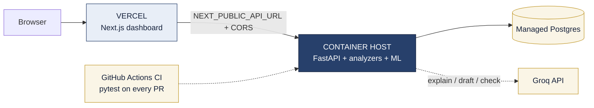

---

## 7. Runtime — opening a flagged item

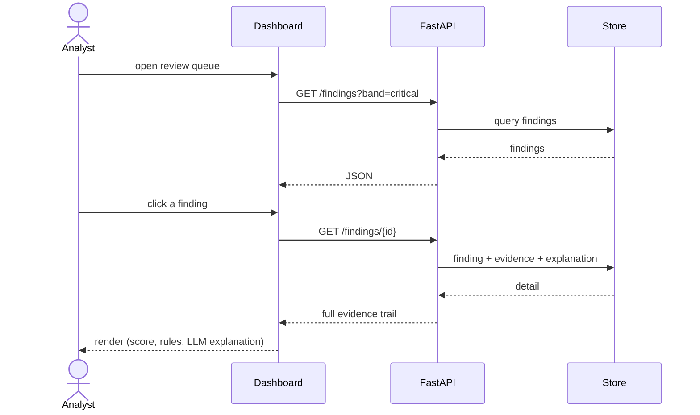

---

## Quickstart

```bash
uv sync
uv run python -m interface.cli generate --accounts 50 --days 30 --out data.csv
uv run python -m interface.cli ingest data.csv
uv run python -m interface.cli run aml            # aml | reconciliation | categorization | disputes | reporting
uv run python -m interface.cli train --labels data.csv
uv run python -m interface.cli evaluate           # regenerate the combined SCORECARD.md
uv run uvicorn interface.api:app --reload         # API
cd frontend && npm install && npm run dev         # dashboard (set NEXT_PUBLIC_API_URL)
```

## Scorecard (per analyzer, the right metric for each)

| Analyzer | Headline (synthetic data; regenerate via `evaluate`) |
|---|---|
| AML | ensemble lift ~+9.6pts recall over rules (~50.0% -> ~59.6%), F1 ~0.702 |
| Reconciliation | ~84.4% recall at 100% precision on injected breaks |
| Categorization | macro-F1 ~0.51 (lightweight TF-IDF + NB) |
| Disputes | workflow metrics — 42.9% win rate, 37 open |
| Reporting | grounded SAR drafts with a faithfulness check (needs a Groq key) |

*Keep this in sync with `SCORECARD.md` — both come from one `evaluate` run.*

## Docs

`spec.md` (technical spec) · `AGENTS.md` (contributor + agent guide) · `CLAUDE.md` (Claude quick ref) · `DEPLOYMENT.md` (Vercel + backend) · `Roadmap.md` (phase history)
